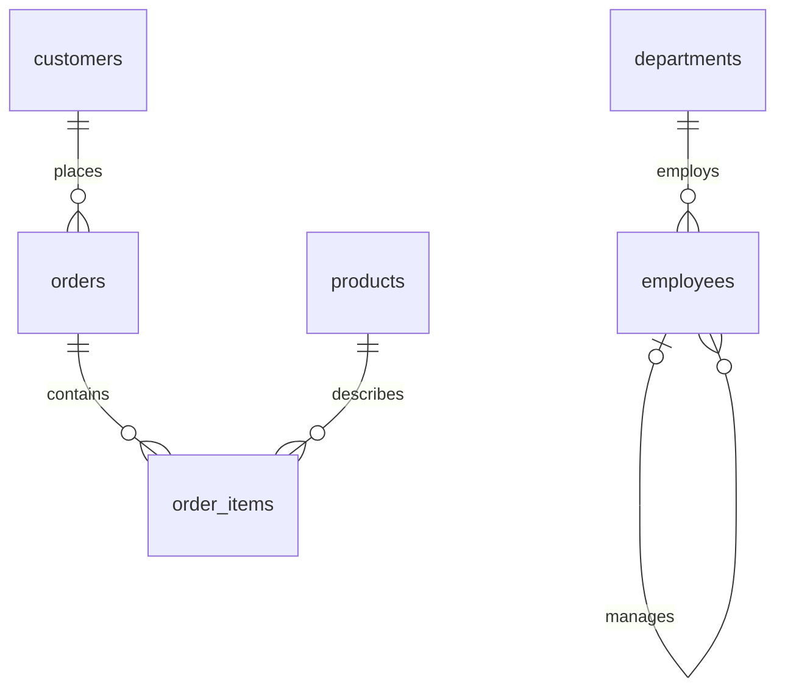

# 0. Shared Practice Database

> **Purpose:** Provide a small reproducible dataset for every chapter. Run the setup in a new, disposable database, not an existing application database. Table names are intentionally simple.

## Model and grain

**Grain** means what one row represents. State it before joining or aggregating.

| Table | One row represents | Key |
|---|---|---|
| `customers` | A customer | `customer_id` |
| `products` | A catalog product | `product_id` |
| `orders` | An order header | `order_id` |
| `order_items` | A line within an order | `(order_id, line_no)` |
| `departments` | A department | `department_id` |
| `employees` | An employee | `employee_id` |



All prices are **integer cents in one assumed currency**. This makes exact totals portable in these examples. The employee salary is an integer annual amount in a separate teaching dataset. Do not combine those units.

Dates use ISO `YYYY-MM-DD`. SQLite stores these examples as text-like values under type affinity; PostgreSQL/MySQL/SQL Server have native date types. The date chapter explains the consequences.

## Setup

For SQLite, enable foreign-key enforcement on each connection **before starting a transaction**:

<!-- dialect: sqlite -->
```sql
PRAGMA foreign_keys = ON;
```

The following schema and inserts use a common subset supported by current SQLite and PostgreSQL, and broadly by current MySQL/SQL Server. IDs are supplied explicitly to avoid identity-column syntax differences. Modern MySQL requires an engine that enforces the declared foreign keys, such as InnoDB.

```sql
CREATE TABLE customers (
    customer_id INTEGER PRIMARY KEY,
    customer_name VARCHAR(100) NOT NULL,
    region VARCHAR(30),
    email VARCHAR(200) UNIQUE,
    signup_date DATE NOT NULL
);

CREATE TABLE products (
    product_id INTEGER PRIMARY KEY,
    product_name VARCHAR(100) NOT NULL,
    category VARCHAR(30) NOT NULL,
    price_cents INTEGER NOT NULL CHECK (price_cents >= 0)
);

CREATE TABLE orders (
    order_id INTEGER PRIMARY KEY,
    customer_id INTEGER NOT NULL,
    order_date DATE NOT NULL,
    status VARCHAR(20) NOT NULL
        CHECK (status IN ('paid', 'pending', 'cancelled')),
    FOREIGN KEY (customer_id) REFERENCES customers(customer_id)
);

CREATE TABLE order_items (
    order_id INTEGER NOT NULL,
    line_no INTEGER NOT NULL,
    product_id INTEGER NOT NULL,
    quantity INTEGER NOT NULL CHECK (quantity > 0),
    unit_price_cents INTEGER NOT NULL CHECK (unit_price_cents >= 0),
    PRIMARY KEY (order_id, line_no),
    FOREIGN KEY (order_id) REFERENCES orders(order_id),
    FOREIGN KEY (product_id) REFERENCES products(product_id)
);

CREATE TABLE departments (
    department_id INTEGER PRIMARY KEY,
    department_name VARCHAR(100) NOT NULL UNIQUE
);

CREATE TABLE employees (
    employee_id INTEGER PRIMARY KEY,
    employee_name VARCHAR(100) NOT NULL,
    department_id INTEGER NOT NULL,
    manager_id INTEGER,
    salary INTEGER NOT NULL CHECK (salary >= 0),
    FOREIGN KEY (department_id) REFERENCES departments(department_id),
    FOREIGN KEY (manager_id) REFERENCES employees(employee_id)
);

INSERT INTO customers (customer_id, customer_name, region, email, signup_date) VALUES
    (1, 'Asha', 'North', 'asha@example.com', '2025-12-01'),
    (2, 'Dev', 'South', 'dev@example.com', '2025-12-10'),
    (3, 'Mira', 'North', 'mira@example.com', '2026-01-01'),
    (4, 'Noor', 'West', NULL, '2026-01-10'),
    (5, 'Ishan', NULL, NULL, '2026-02-01');

INSERT INTO products (product_id, product_name, category, price_cents) VALUES
    (10, 'Notebook', 'Books', 1000),
    (20, 'Python course', 'Learning', 3000),
    (30, 'Data toolkit', 'Tools', 5000),
    (40, 'SQL workbook', 'Books', 2000);

INSERT INTO orders (order_id, customer_id, order_date, status) VALUES
    (101, 1, '2026-01-02', 'paid'),
    (102, 1, '2026-01-05', 'paid'),
    (103, 2, '2026-01-03', 'paid'),
    (104, 3, '2026-01-05', 'cancelled'),
    (105, 2, '2026-02-01', 'paid'),
    (106, 4, '2026-02-03', 'pending'),
    (107, 3, '2026-02-05', 'paid'),
    (108, 1, '2026-02-05', 'paid');

INSERT INTO order_items (order_id, line_no, product_id, quantity, unit_price_cents) VALUES
    (101, 1, 10, 2, 1000),
    (101, 2, 20, 1, 3000),
    (102, 1, 10, 1, 1000),
    (103, 1, 20, 2, 3000),
    (104, 1, 30, 1, 5000),
    (105, 1, 10, 3, 1000),
    (105, 2, 30, 1, 5000),
    (106, 1, 20, 1, 3000),
    (107, 1, 30, 1, 5000),
    (108, 1, 20, 1, 3000);

INSERT INTO departments (department_id, department_name) VALUES
    (10, 'Engineering'), (20, 'Data'), (30, 'Support');

INSERT INTO employees (employee_id, employee_name, department_id, manager_id, salary) VALUES
    (1, 'Asha', 10, NULL, 120000);
INSERT INTO employees (employee_id, employee_name, department_id, manager_id, salary) VALUES
    (2, 'Dev', 10, 1, 90000),
    (3, 'Mira', 20, 1, 90000),
    (6, 'Tara', 30, 1, 60000);
INSERT INTO employees (employee_id, employee_name, department_id, manager_id, salary) VALUES
    (4, 'Noor', 20, 3, 70000),
    (5, 'Ishan', 20, 3, 70000);
```

**SQL Server adjustment:** An ordinary single-column UNIQUE constraint normally allows only one NULL. For this sample, remove `UNIQUE` from `email` and create a filtered unique index on non-null emails, as shown in the [dialect reference](12-dialects-and-command-reference.md). SQLite, PostgreSQL's default unique behavior, and MySQL allow multiple NULLs here.

The transaction price is copied into `order_items.unit_price_cents`. Updating today's catalog price must not rewrite the price of a past purchase. A foreign key from an order line to a product does not require the historical price to equal the current catalog price.

## Baseline checks

```sql
SELECT COUNT(*) AS customer_count FROM customers;
SELECT COUNT(*) AS order_count FROM orders;
SELECT COUNT(*) AS item_count FROM order_items;

SELECT SUM(oi.quantity * oi.unit_price_cents) AS paid_revenue_cents
FROM orders AS o
JOIN order_items AS oi ON oi.order_id = o.order_id
WHERE o.status = 'paid';
```

Expected: **5 customers, 8 orders, 10 lines, 28,000 paid revenue cents**. There are six paid orders. Ishan has no orders; Noor has a pending order but no paid order; the SQL workbook has never been ordered. Salary ties are intentional.

| Paid order | Revenue cents |
|---|---:|
| 101 | 5000 |
| 102 | 1000 |
| 103 | 6000 |
| 105 | 8000 |
| 107 | 5000 |
| 108 | 3000 |

Examples generally assume this baseline. Run each chapter against a fresh setup if you experiment with data changes. Blocks labeled PostgreSQL/MySQL/SQL Server are dialect examples, not commands to paste into SQLite.

Reference: [SQLite foreign-key enforcement](https://www.sqlite.org/foreignkeys.html). Next: [SELECT, filtering, and NULL](01-select-filtering-and-null.md).
